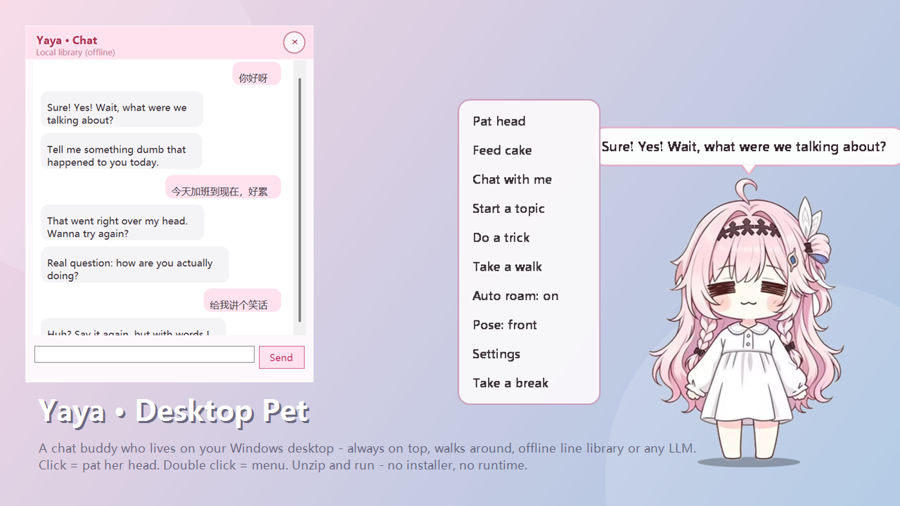

# Yaya · Desktop Pet (娅娅 · 桌面宠物)

> A tiny girl who lives on your Windows desktop. Always on top, truly transparent, walks around by herself,
> chats with you (offline line library, or a real LLM if you plug in an API key).
> **No installer, no runtime to install, ~1 MB.** Just unzip and double-click.
>
> 中文说明：[README.zh-CN.md](README.zh-CN.md) · 中文使用说明：`使用说明.txt`



---

## ✨ What she does

| | |
|---|---|
| **Lives on your desktop** | A per-pixel transparent, always-on-top, borderless window. She sits **on top of your wallpaper and windows**, does not appear in the taskbar, and does **not steal focus** while you type. Fully transparent pixels are click-through, so she never blocks your work. |
| **Single click / double click** | Single click = **pat her head** (hop + hearts + affection +1). Double click (or right click) = **open the menu**. |
| **Poke her 4+ times fast** | She pretends to get annoyed. |
| **Drag her** | Drop her anywhere; she remembers the spot next time. |
| **Cursor nearby** | She notices you and hops (90 s cooldown, so she's not clingy). |
| **Walks around by herself** | Every 15–30 s she strolls somewhere else on the desktop (side view, facing the direction she walks). |
| **Feed her cake** | Cake drops in, hearts float up, affection +3. Max 3 slices a day — the 4th gets a cute refusal. |
| **Tricks** | Hop, spin, wave, dance, stretch, look back, sit down — each with its own animation and lines. |
| **Idle stages** | 3 min: she tries to get your attention. 5 min: she wanders off, bored. 8 min: dozing off. 12 min: fast asleep. The moment you touch the keyboard she jolts awake. |
| **Time-aware greetings** | Different lines for morning / afternoon / evening / late night, and she says she missed you if you haven't opened the PC in days. |
| **Affection levels** | Just met → Getting closer → Friend → Good friend → Bestie. Levelling up unlocks lines only close friends get to hear. |
| **Tray icon** | Let her rest / call her back / settings / quit. |

## 💬 Two chat modes (pick in Settings)

1. **Local library (default)** — 100% offline, no account, no cost. She matches keywords in what you type and
   answers from **492 hand-written lines across 85 categories** (English and Chinese libraries both included).
   Sometimes she follows up with a second line.
2. **AI chat** — plug in an API key and she becomes a real LLM conversation, remembering the last 12 turns.
   Defaults to DeepSeek; **any OpenAI-compatible endpoint works** (OpenAI, Ollama, Moonshot, Qwen, …).
   There is a **Test connection** button. No key? She just keeps using the local library and tells you why.

**Language**: Settings → Language → `中文 / English`. The whole UI, her lines and her AI persona follow it.

## 📦 Download & run

1. Grab `YayaDesktopPet-v1.0-win.zip` from the [Releases](../../releases) page.
2. Unzip it anywhere (Desktop / D:\ is fine — **avoid `C:\Program Files`**, she needs to write her save file next to the exe).
3. Double-click `娅娅桌面宠物.exe`.

Building it yourself? `tools\build.bat` for your own build, and `tools\make-release.bat` for the clean
public release (stages a tree without any third-party art, builds the icon from the placeholder mascot,
and writes `dist\YayaDesktopPet-v1.0-win.zip` + a source zip).

**Requirements:** Windows 7 or newer. That's it — the app targets the in-box .NET Framework 4.x
(preinstalled on Win 8/10/11). No Node, no Python, no runtime download. The local mode never touches the network.

> **Windows SmartScreen**: the exe is not code-signed, so the first run may show "Windows protected your PC".
> Click **More info → Run anyway**. If you downloaded a zip, right-click it → Properties → check **Unblock**
> *before* extracting and you won't see the prompt at all.

## 🔒 Privacy

- Local library mode: **completely offline**. She never connects to anything.
- AI mode: only the messages you type are sent — to **the endpoint you configured yourself**. Nothing else.
- She does not record what you type, does not read your files, and does not log your keystrokes.
  The "is the user idle" check uses a single Windows API (`GetLastInputInfo`) that returns one timestamp.
- Your save file (`data/state.json`) holds the name, affection, window position, size and settings.
  An API key, if you add one, is encrypted with **Windows DPAPI** (per-user) before being written to disk.

## 🎨 Bring your own character

The repo ships an **original placeholder mascot** (`content/placeholder/`, drawn entirely in code by
`tools/MakePlaceholder.cs`) so the app runs out of the box with zero third-party art.

To use your own character:

```bat
:: 1) put your 3-view character sheet in content\sheet\ (front / side / back, on a plain background)
:: 2) cut it into transparent sprites (prints the crop boxes so you can check nothing is chopped)
tools\make-sprites.exe content\sheet\your-sheet.jpg content\sprites "59-376,392-791,809-1226"
:: 3) (optional) regenerate the program icon from the new face
tools\build.bat
```

If `content/sprites/` is missing or incomplete she automatically falls back to the placeholder.

## 🛠 Build from source

No Visual Studio, no .NET SDK, no NuGet — just the C# compiler that ships with Windows:

```bat
tools\build.bat          :: compiles src\*.cs -> 娅娅桌面宠物.exe (+ generates app.ico from her avatar)
tools\make-package.bat   :: produces dist\*.zip (runtime package + source package)
tools\selftest.bat       :: one-click self-test (see below)
```

Source layout:

```
src/
  App.cs             entry point, tray icon, state, AI channel, self-test
  PetWindow.cs       the layered pet window: drawing, bubbles, effects, drag, walking, idle stages
  LayeredWindow.cs   layered-window base (UpdateLayeredWindow = real per-pixel alpha)
  MenuWindow.cs      the self-drawn popup menu
  ChatWindow.cs      chat window (input box + transcript)
  SettingsWindow.cs  settings (name, chat mode, API key, size slider, language, autostart)
  AiChat.cs          OpenAI-compatible API calls
  Lines.cs           line library + local chat engine (keyword routing, affection gating)
  Lang.cs            UI string table (中文 / English)
  Sprite.cs          sprite loading/scaling/flipping
  Store.cs           state persistence (DPAPI-encrypted API key)
  Json.cs            tiny JSON parser/writer (no external deps)
  AssemblyInfo.cs    product name / version
content/
  lines.json         Chinese line library (85 categories / 492 lines)
  lines.en.json      English line library (same structure)
  sprites/           your character (optional; falls back to placeholder/)
  placeholder/       original placeholder mascot
tools/               build / packaging / self-test + diagnostics (see below)
```

### One-click self-test

`tools\selftest.bat` runs headless and writes `data\selftest\selftest.txt` plus ~16 PNGs:
library integrity, keyword routing (both languages), affection progression, banned-word scan,
a full chat round-trip, click rules (single = pat / double = menu / spam = annoyed), whether walking
really moves the window, and frame dumps of every action, pose, sleeping, feeding and the menu.

Handy diagnostics (all documented in `README.zh-CN.md`):

| tool | what it does |
|---|---|
| `娅娅桌面宠物.exe --dump out.png --dump-after 1600` | saves the current frame (with alpha) so you can see exactly what she renders |
| `娅娅桌面宠物.exe --selftest <dir>` | the headless self-test above |
| `tools\drawtest.exe` | renders the sprite in isolation (to tell "drawing bug" from "positioning bug") |
| `tools\bbox.exe` | prints the non-transparent bounding box / row profile of a PNG |
| `tools\probe.exe` | asks Windows which window is on top at given pixels (proves she's composited and click-through) |
| `tools\make-icon.exe --lab` | side-by-side icon style sheet at several sizes |

## 🐞 Known issues / gotchas

- **DPI scaling**: GDI+ scales `GraphicsUnit.Display` by `dpi/96` for bitmap-backed `Graphics`, and
  `DrawImageUnscaled` magnifies 96-DPI art on a 144-DPI device. Both are handled explicitly
  (`LayeredWindow.EnsureBuffer` pins 96 DPI + `PageUnit.Pixel`; `Sprite.LoadPng` copies pixels byte-wise).
  Symptom if you break it: *the character renders as a giant head / only her upper half.*
- **`.ico` entries**: Windows' shell renders PNG-compressed icon entries unreliably below 128 px
  (blank or scrambled icon). This project writes **BMP/DIB entries for 16–128** and PNG only for 256.
- **Shortcut icon caching**: Windows caches icons per path, so replacing the icon embedded in the exe
  may keep showing the old one. The desktop shortcut therefore points at the standalone `娅娅.ico`
  (a fresh path = a fresh read), and the shortcut is rewritten on every launch.
- **Walking** must move the window itself, not just the internal coordinate
  (see the walking branch in `PetWindow.Tick`) — the self-test asserts this.

## 📄 License & artwork

- **Code, dialogue text and docs: MIT** (see [LICENSE](LICENSE)).
- **The character art in `content/sprites/` is NOT covered by MIT.** It is an **AI-generated image
  of unknown origin** (it was circulating online with a bilibili watermark), so:
  - **no author can be credited** — this project claims **no rights** over it;
  - it should **not be treated as commercially usable** (some AI services restrict commercial use of
    free-tier output, and we cannot know which service produced it);
  - **if you are whoever generated or first posted it** and want it removed, open an issue — it will be
    replaced immediately (the app falls back to the original placeholder mascot in
    `content/placeholder/`, which *is* MIT and free to use commercially).
  - Full write-up: [ATTRIBUTION.md](ATTRIBUTION.md).
- **Want a 100% clean build?** Delete `content/sprites/` (or uncomment the three lines in
  `.gitignore`) and the app automatically uses the **code-drawn placeholder mascot**
  (`tools/MakePlaceholder.cs` → `content/placeholder/`), which is original to this project.
- **Use your own character**: drop your 3-view sheet into `content/sheet/` and run
  `tools\make-sprites.exe` (details above) — then it's your licence and your credit line.

## 🌏 中文

完整的中文文档（开发细节、排障、口径说明）在 [README.zh-CN.md](README.zh-CN.md)，
面向使用者的说明是压缩包里的 `使用说明.txt`。
